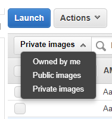
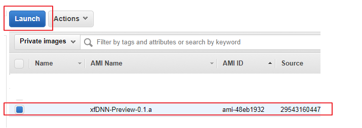
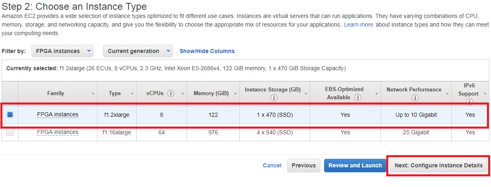
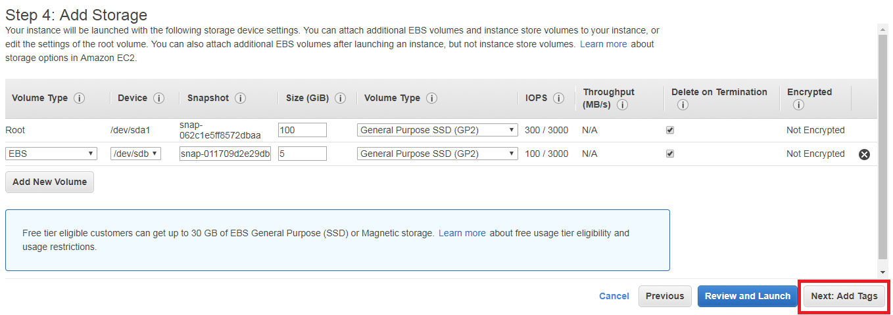
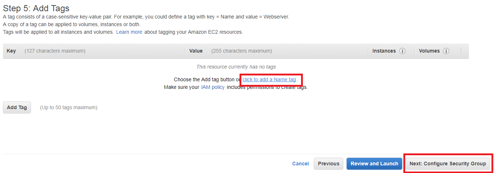
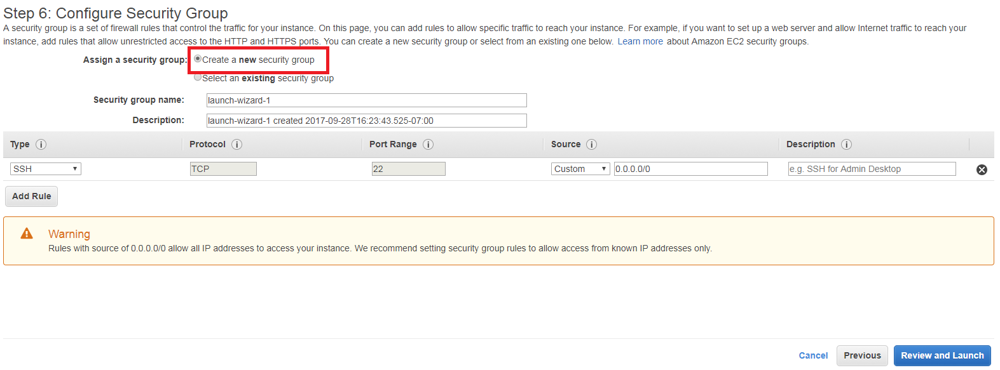
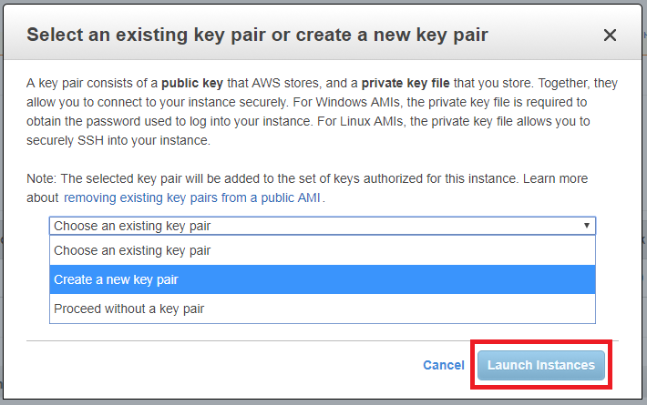
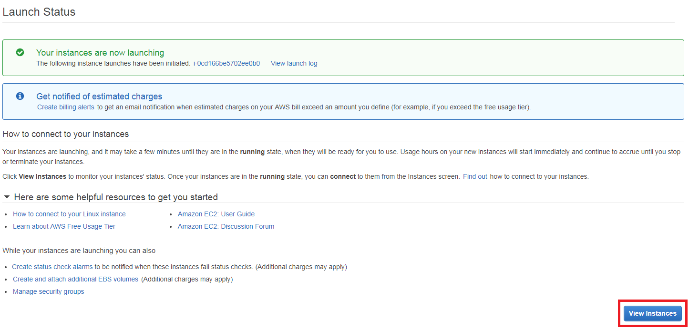

# Launching Test Drive

Log into your ECs conscole and click on AMIs on the left hand side. Seclect
"Private Images" from the drop down box near te filter bar.

## Step 1: Select AMI

Select the "xfDNN-Preview-0.2a" from the list and click "Launch" (above image shows xfDNN-Preview-0.1a)

## Step 2: Choose an Instance Type

You may select either the f1.2xlarge or f1.16xlarge instance for this test drive.

Click "Next: Configure Instance Details

## Step 3: Configure Instance Details
\
Leave the default settings, and click "Next: Add Storage"

## Step 4: Add Storage

Leave the default settings, and click "Next: Add Tags"

## Step 5: Add Tags

Click "click to add a Name tag" to give the instance a name, then click "Next: Configure Security Group"

## Step 6: Configure Security Group

Click "Create a new security group"

Create the following rules:

| Type					| Protocol	| Port Range		| Source 								| Description 			|
|---------------|-----------|---------------|-----------------------|-------------------|
|HTTP						| TCP 			| 80 						| 0.0.0.0/0							| HTTP							|
|Custom TCP Rule| TCP 			| 8080					| 0.0.0.0/0							| Deep Detect				|
|All Traffic		| All 			| All 					| [Security Group Name]	| Internal Traffic	|
|Custom TCP Rule| TCP 			| 8888-8900			| 0.0.0.0/0							| Deep Detect				|
|SSH						| TCP 			| 22 						| 0.0.0.0/0							| SSH								|
|Custom TCP Rule| TCP 			| 8998-8999			| 0.0.0.0/0							| xfDNN Demo				|
|HTTPS					| TCP 			| 443						| 0.0.0.0/0							| HTTPS							|

It should look like this once the rules are added:

Click "Review and Launch"

## Step 7: Review Instance Launch

Review your settings and click "Launch"

Select or create a key pair to authenticate this instance and click "Launch Instance"

The Test Drive instance will begin to launch. Click "View Instances" to access it.

## Test Drive Ready

Now under "Instances" you will see your running Test Drive Instance.
If you click on it, it will show you your public IP address you will need to know to access it.

## Connecting to Your Instance
**To access your instance:**
1. Open an SSH client. (find out how to [connect using PuTTY][])
2. Locate your private key file (yourkey.pem). The wizard automatically detects the key you used to launch the instance.
3. Your key must not be publicly viewable for SSH to work. Use this command if needed:

	`chmod 400 yourkey.pem`

4. Connect to your instance using its Public DNS:

	`yourpublicdns.compute-1.amazonaws.com`

**Example:**

`ssh -i "yourkey.pem" root@yourpublicdns.compute-1.amazonaws.com`

Please note that in most cases the username above will be correct, however please ensure that you read your AMI usage instructions to ensure that the AMI owner has not changed the default AMI username.
If you need any assistance connecting to your instance, please see our [connection documentation][].

[connect using PuTTY]: https://docs.aws.amazon.com/console/ec2/instances/connect/putty
[connection documentation]: https://docs.aws.amazon.com/console/ec2/instances/connect/docs
